# Brief_ANSIBLE

## Command & Control (C2) via Ansible

---

### Contexte du lab

#### VMware

* Lubuntu Master - **Ansible Host** : (192.168.72.129)
* Lubuntu Clone **Ansible Control Node** (192.168.72.255)

(même nom d'user pour les deux machines "serveur1")

---

### **Ansible Control Node**

#### Installation

    sudo apt update

    sudo apt install ansible

#### Creation repertoire  

    sudo mkdir /etc/ansible

#### Installer l'utilitaire de mot de passe

    sudo apt install sshpass -y

#### Créer l'inventaire

    nano /etc/ansible/inventory.ini

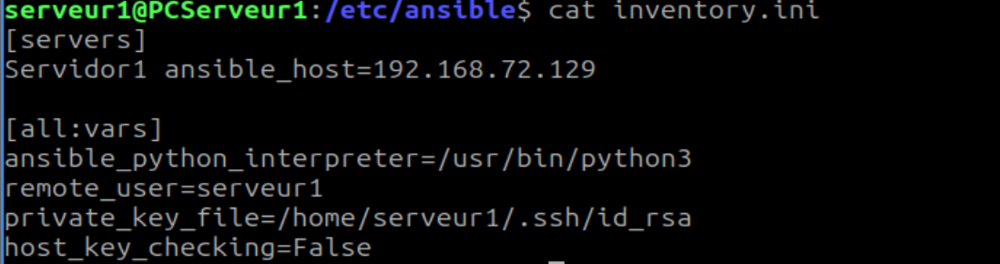

#### Configuration de clés SSH

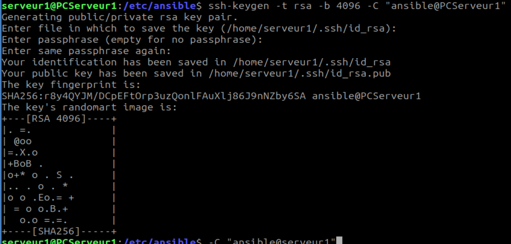

    ssh-copy-id serveur1@192.168.72.129

#### Test (Ping)

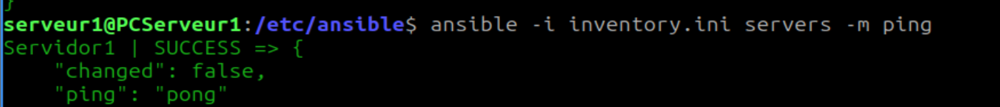

---

### **Playbooks**

**UPDATE_OS**

    nano 1-update-os.yml

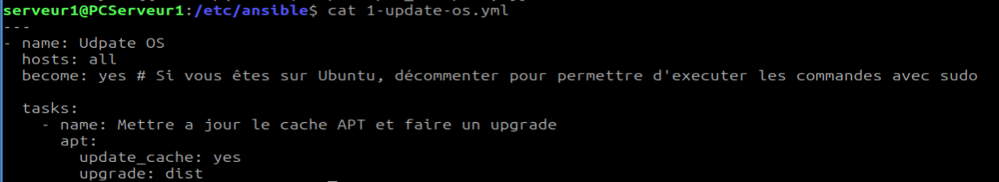

**Exécution**

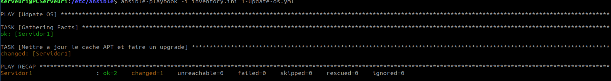

**CREATE_USER**

    nano 2-create-user.yml

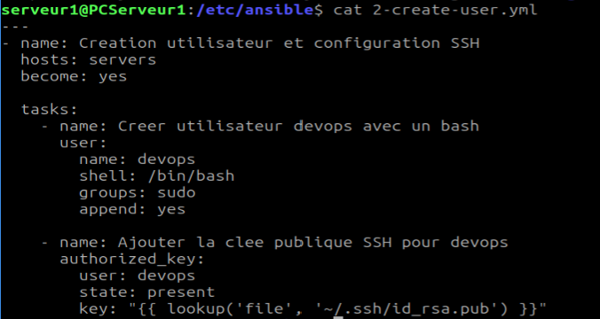

**Exécution**

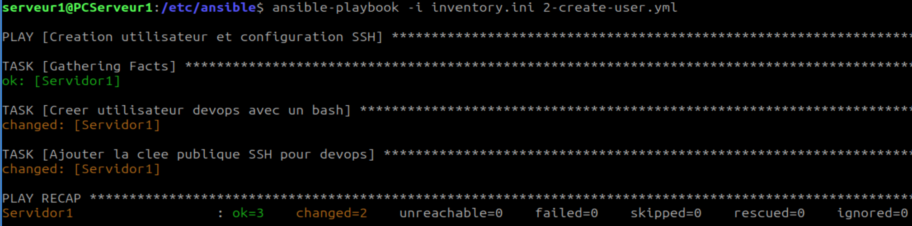

**Test connexion ssh**

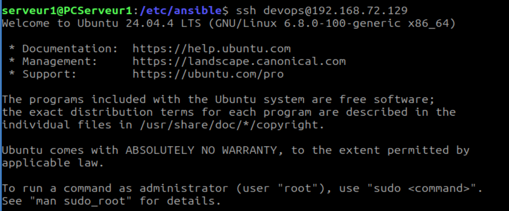

---
### **Ansible Host**

#### Renseignement d'un utilisateur autorisé sudoers

    sudo usermod -aG sudo devops

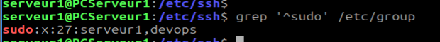
---

**DEPLOYMENT NGINX + SITE DEMO**

Preparations des répertoires + téléchargement des fichiers du site demo

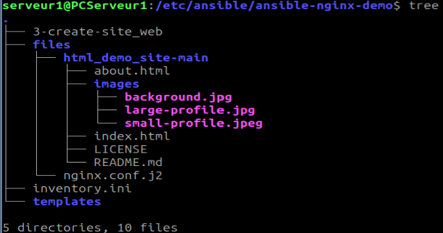

    nano 3-create-site_web.yml

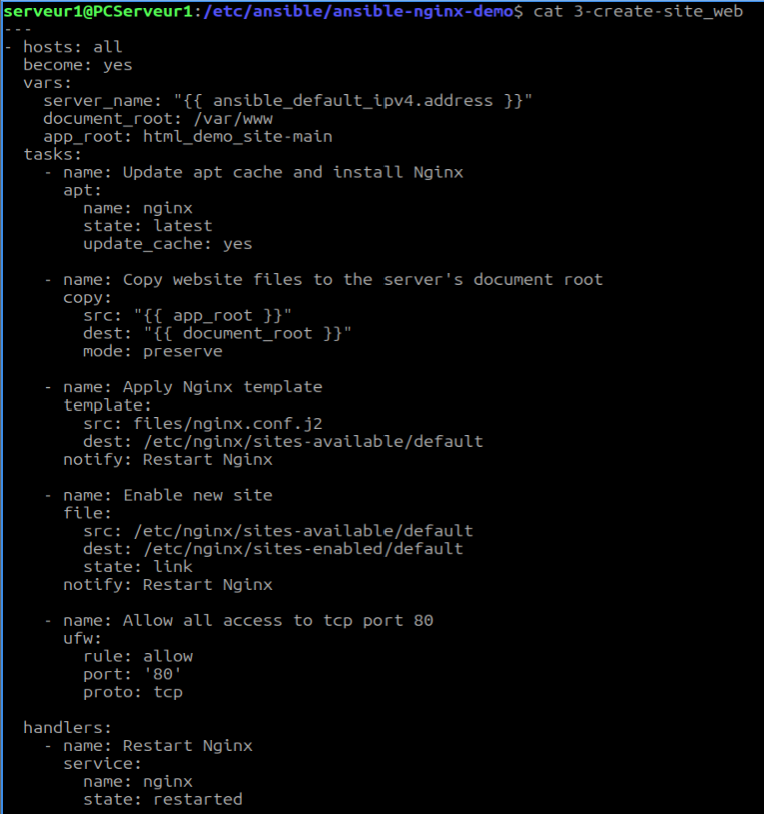

**Exécution**

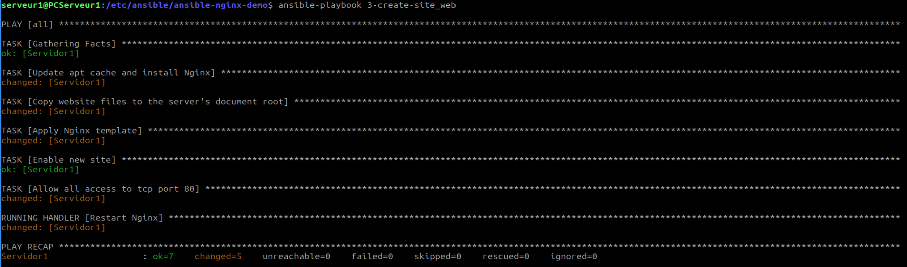

#### Test du site depuis un VM Windows

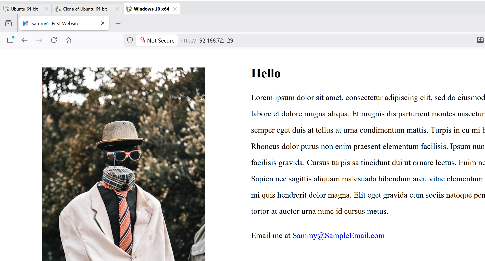

---

### Creation fichier ansible.cfg

    nano ansible.cfg

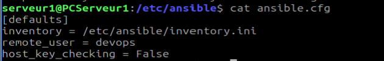

Test sans MDP (devops ajouté au visudo avec <devops ALL=(ALL) NOPASSWD:ALL> ) Ajout de MDP Plus tard avec **Ansible Vault**

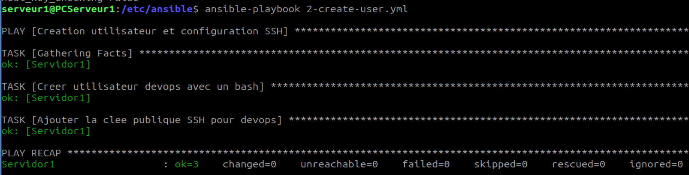

---

## **Sécurisation des secrets avec Ansible Vault**

### **Création du coffre-fort (Vault)**

    ansible-vault create secrets.yml

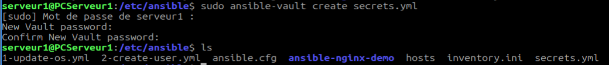    

### Modification temporaire des fichiers inventory.ini et ansible.cfg

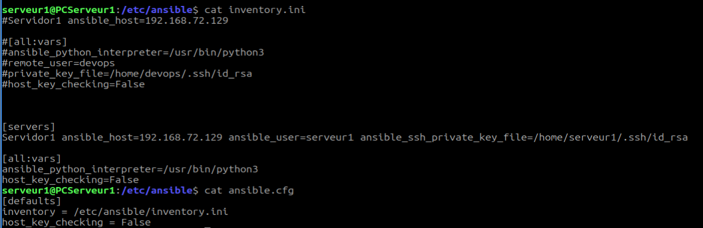

### Suppression de l'ancien user devops dans la machine host

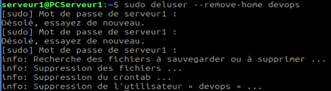

### **Creation du password de "devops"**

#### Playbook

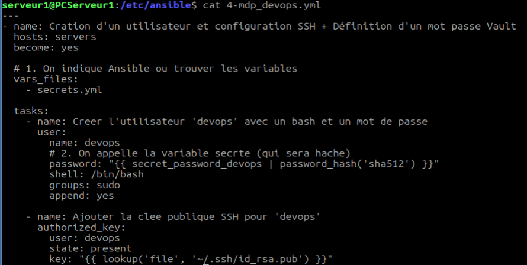

**Execution** 

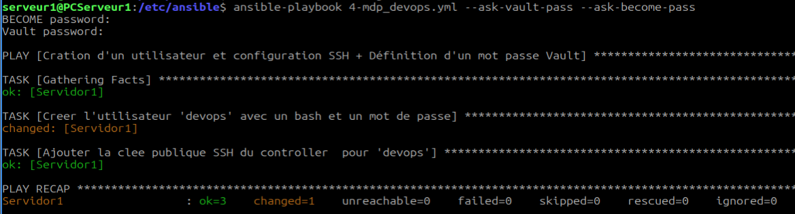

**Test connexion ssh et ping**

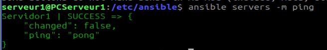

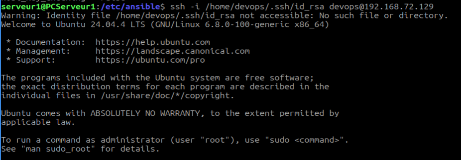

### Modification definitive inventory.ini et ansible.cfg

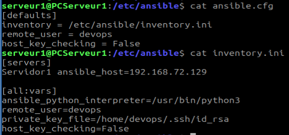

### Modification du vault pour ajouter `ansible_become_pass`

    ansible-vault edit secrets.yml

on ajoute la ligne : `ansible_become_pass: "{{ secret_password_devops }}"` #il appel la variable qu'on avait inséré avant (`secret_password_devops: "mon_mdp_devops"`) pour le mdp sudo.

### Modification du Playbook 1 (1-update-os.yml) de mise à jour pour test de Ansible Vault

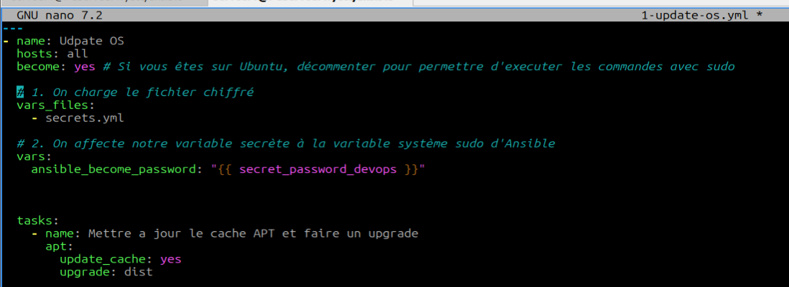

**Execution**

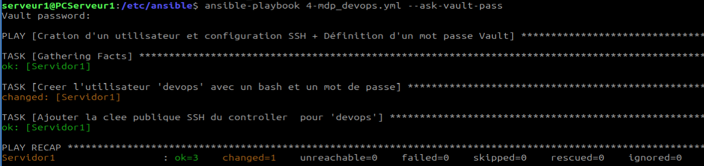

